  

  

  
  

  

  

- 🎓 B.Tech in Computer Science at **MIT-WPU, Pune** (2023 – 2027), CGPA **8.79**
- 💼 Software Engineer Intern at **Infosys** (Apr – May 2026), where I built a Retail Store Management System for iPhone and iPad with a team of 10
- 🔭 Building backend systems with **Java, Spring Boot, REST APIs and microservices**
- ☁️ Deploying on **Render, Vercel and Cloudflare** with Docker
- 🤖 Integrating LLMs (Gemini API) into real products
- 🔄 Comfortable with **Agile/Scrum** and the full SDLC
- 📍 Pune, India

  

  

  

  

  

### 🏋️ Fitness Web Application
A fitness platform built on **3 Spring Boot microservices** (User, Activity, AI Recommendation).
- Uses **PostgreSQL** for structured data and **MongoDB** for unstructured data
- Scalable backend with **API Gateway, Eureka Server and Config Server** for secure inter-service communication
- Generates personalized workout recommendations with the **Gemini API**, with all requests secured by **OAuth2/JWT** (Keycloak)
- RESTful APIs with distributed services wired together through Spring Cloud and **RabbitMQ**

**Stack:** `Java` `Spring Boot` `Spring Cloud` `MongoDB` `PostgreSQL` `RabbitMQ` `Keycloak`

  

### 🎓 RuinMIT
A full-stack campus platform for MIT-WPU students with **5 modules**: Gigs, Rides, Marketplace, Flatmates, and Lost & Found.
- **React + Tailwind** frontend with a **Spring Boot + PostgreSQL** backend
- Fixed **N+1 query bottlenecks** and built real-time features: **SSE notifications** and a **WebSockets + STOMP** chat
- Backend containerized with **Docker** and deployed on **Render**; frontend deployed on **Vercel** with a **Cloudflare** custom domain

**Stack:** `Java` `Spring Boot` `React` `PostgreSQL` `WebSockets` `Docker` `Cloudinary`

  

### ✉️ Smart Email Reply Generator
A **Chrome Extension** with a Spring Boot backend that adds an **AI Reply** button inside Gmail Compose for one-click replies.
- REST APIs process email content and call the **Gemini API** for context-aware replies
- Scoped **CORS policies** and secured backend communication between the extension and server

**Stack:** `Java` `Spring Boot` `Spring WebFlux` `Chrome Extension`

  

### 🛍️ Retail Store Management System *(Infosys Internship)*
An iPhone and iPad app built with **SwiftUI** by a team of 10 in an Agile/Scrum setup, using Jira, Supabase, Git and GitHub. I took part in sprint planning, design discussions, testing and code reviews.

**Stack:** `Swift` `SwiftUI` `Supabase` `Jira` `GitHub`

  

  

  

  

  

- **Deloitte Australia Technology Job Simulation** (Forage), Jun 2025 · [View certificate](https://drive.google.com/file/d/1vCczKbdf7b1XXhklynbrzvryAt8vXI0l/view?usp=sharing)

  

  

  
  

<i>⭐ If you like my work, drop a star on a repo!</i>

  

